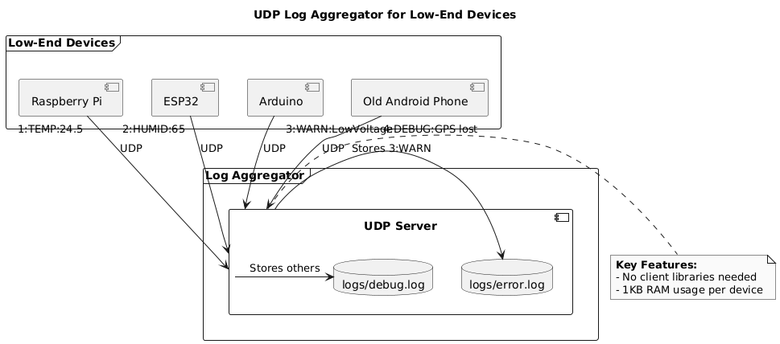

# UDP Log Aggregator for Low-End Devices

This project implements a lightweight, multithreaded **UDP-based log aggregation server** designed to collect logs from **low-resource devices** like Raspberry Pi, ESP32, Arduino, and legacy Android phones. It’s ideal for scenarios where minimal network overhead and low memory usage are critical.

---

## Tech Stack

- **Java 17**
- **UDP Sockets (DatagramSocket)**
- **Multithreading (ExecutorService)**
- **File-based Log Storage**
- **Custom Packet Loss Tracking**

---

## Why UDP?

This project deliberately uses **UDP over TCP** to support:

- Lower memory and processing requirements on the sender.
- Tolerance for lossy environments like Wi-Fi connected sensors.
- Simple, stateless communication.

This tradeoff is justified for use cases like **IoT logging**, **legacy hardware monitoring**, or **ad-hoc data collection** where occasional packet loss is acceptable.

---

## Features

- **Zero Dependency** for clients — just send plain UDP packets.
- **Thread-Pooled UDP Server** for concurrent log processing.
- Logs are categorized by log level (`error.log`, `debug.log`, etc.).
- **Packet Loss Detection** using sequence numbers per client.
- Supports devices with <1KB memory footprint for networking.

---

## Sample Log Packet Format

Clients send logs in the format:

```
<sequence_number>:<log_level>:<message>
```

Examples:
- `1:INFO:System started`
- `2:WARN:Low voltage`
- `3:ERROR:Failed to connect to sensor`

---
Sample Request Bash
```
echo "1:INFO:Service started" | nc -u -w1 localhost 9876

```
Sample request Windows
```
$socket = New-Object System.Net.Sockets.UdpClient
$bytes = [Text.Encoding]::ASCII.GetBytes("1:INFO:Service started")
$socket.Send($bytes, $bytes.Length, "localhost", 9876)
$socket.Close()

``` 

##  UML Daigram



---

##  Limitations & Trade-offs

- **Packet Loss**  UDP is unreliable by nature. The system uses client-side sequence numbers to track and report missing packets, but **no retransmission** is performed.
- **Storage** Uses file-based storage (`logs/` directory); not scalable for high-volume enterprise environments.
- **Ordering**  Packet arrival order is **not guaranteed**; out-of-order logs may appear in files.

---

## Why UDP?

This project deliberately uses **UDP over TCP** to support:

- Lower memory and processing requirements on the sender.
- Tolerance for lossy environments like Wi-Fi connected sensors.
- Simple, stateless communication.

This tradeoff is justified for use cases like **IoT logging**, **legacy hardware monitoring**, or **ad-hoc data collection** where occasional packet loss is acceptable.

---

## Potential Improvements

- Use **SQLite or embedded DB** for log storage instead of files.
- Add **dashboard or web viewer** for real-time log monitoring.
- Integrate with **Kafka** for production-ready pipelines.

---

## Run the Server
Linux/MacOs bash
```
# Compile and run
javac -d out src/org/priyanshu/server/*.java
java -cp out org.priyanshu.server.LogServer
```
Windows
```
mkdir out
javac -d out src\org\priyanshu\server\*.java
java -cp out org.priyanshu.server.LogServer
```


---

## License
This is a personal project feel free to fork/modify and use.


---